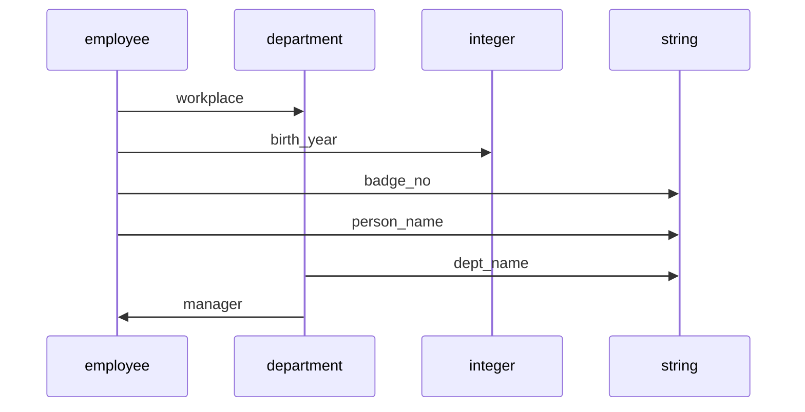
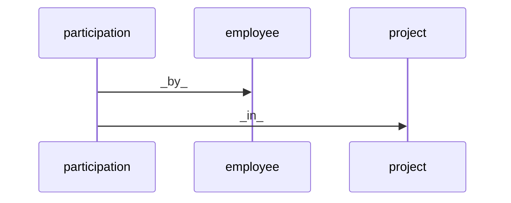

# About

`norm` is an experimental module for JavaScript developers to build and run relational databases *without* using either SQL or object-relational mapping. It includes a query syntax in the functional programming style.

I made this module because I'm interested in seeing how relational databases can be built without the baggage of concepts such as tables, primary keys, foregin keys, normalization, etc. and free of the needs to deal with the quirks of SQL.

`norm` is built on node.js 14+, PostgreSQL 9.5+, node-postgres 8.0+. It does not use any other external module.

## Table of Contents

- [About](#about)
  - [Table of Contents](#table-of-contents)
  - [To do](#to-do)
  - [Principles](#principles)
  - [Define schema](#define-schema)
    - [The 'unique' constraint](#the-unique-constraint)
    - [The 'many-to-many' case](#the-many-to-many-case)
  - [Remove functions and domain](#remove-functions-and-domain)
  - [Insert data](#insert-data)
  - [Update and delete data](#update-and-delete-data)
  - [The `db.where` method](#the-dbwhere-method)
    - [`inv`, `map`, `filter`, and `reduce`](#inv-map-filter-and-reduce)
    - [Combine clauses](#combine-clauses)
  - [Read data](#read-data)
  - [Get schema](#get-schema)
  - [Built-in stuff](#built-in-stuff)
    - [Key implementation details](#key-implementation-details)

## To do
- Extend the query language 
- Support for SQLite

## Principles

Consider a database named `org_chart` for a hypothetical company. 



We can interpret this schema as a group of functions. For example, `workplace` is a function that maps a given employee to their department, and `dept_name` maps a given department to its name as a string. Each function has a source domain and a target domain. For example, the source domain of `person_name` is `employee` and its target domain is `string`.

Functions can be chained together to create new functions, as long as the target of the first one matches the source of the second. Chain `workplace` with `dept_name` and we have the function `workplace => dept_name` that map an employee to their department name. Similarly `workplace => dept_name => manager => person_name` is a function that maps an employee to the name of their department's manager.

## Define schema
Once you are clear about the business logic, defining the schema is simply a matter of defining functions.

First, you need to create a database in postgres and connect it with norm

```js
const { connect } = require("norm");
const config = { user, host, database, password, port };
const db = connect(config);
```

`norm` uses node-postgres pool connection and the `config` object follows node-postgres's specifications.

Then you define the functions

```js
db.define(`workplace: employee -> department`, `person_name: employee -> string `, ...).then(...).catch(...);
db.define(`dept_name: department -> string`, ...).then(...).catch(...);
// db.define can be called one or multiple times, and given one or multiple definitions as input
```
Domains are either built-in (`string`, `interger`, `date`, etc.) or infered from function definitions by `norm`.

### The 'unique' constraint
You can ensure each employee has a unique badge number by putting `unique` in the definition

```js
db.define(`badge_no: employee -> string unique`).then(...).catch(...);
```

### The 'many-to-many' case
Supposed we want to add `project` to the schema. The problem is many employees can participate in the same project and an employee can participate in many projects. Therefor there are no functions that map an employee to a project or vice versa.

We can work around this problem by creating a new domain called `participation`, which has a function `_by_` to employee and `_in_` to project 



```js
db.define(`_by_: participation -> employee unique`, `_by_: participation -> employee unique`).then(...).catch(...);
```

Or use the shorthand
```js
db.define(`_by_ * _in_: participation -> employee * project`).then(...).catch(...);
```

## Remove functions and domain
```js
db.remove(`function_or_domain_name`).then(...).catch(...);
```

If a domain is removed, all functions going to and coming from it will also be removed: removing `department` will also removed `workplace`, `dept_name`, `manager` and all the attendant data.

## Insert data
Say you want to insert a new employee named 'Bond', born in 1984, and has badge number '007'.

```js
db.add(`employee`).set(`name = 'Jim Bond'`, `birth_year = 1984`, `badge_no = '007'`).then(...).catch(...);
```

You can only insert one item at a time.

## Update and delete data
You discover a mistake: the name is `James Bond`, not `Jim Bond`. Also you need to delete his birth year since nobody knows when he was born.

```js
db.where(`employee => badge_no => filter(= '007')`).set(`name = 'James Bond'`, `birth_year = _|_`).then(...).catch(...);
```

Let's unpack this code:
- the `where` method locate the employee(s) that has badge number '007'
- the `set` method then update the name and birth year of those employees. If there are two employees with badge number '007', they will both get updated. However, since we already put the `unique` constraint on the `badge_no` function, there is at most one such employee. If there are no employee satisfying the condition then nothing is updated.
- Mapping the employee's birth year to `_|_` is equivalent to deleting it
- We supply the `where` method with a function that has `employee` as its source domain and return a falsy or a truthy value. The `where` method filters out the items that are mapped to falsy values. More on this below.

## The `db.where` method
A few examples:
- `db.where("employee")` returns all employees
- `db.where("employee => birth_year")` returns all employees with birth year recorded
- `db.where("employee => workplace => manager => gender => filter(= 'female'))` returns all employees who work in a department managed by a female executive
- `db.where("department => inv(workplace) => salary => reduce(avg) => map(ceil) => filter(>= 50000))` returns all departments in which the average salary is US$ 50,000 or above after rounding up

### `inv`, `map`, `filter`, and `reduce`
Consider the last example `department => inv(workplace) => salary => reduce(avg) => map(ceil) => filter(>= 50000))`
- `inv(f)` inverses a function `f`. If `workplace` maps an employee to a department, `inv(workplace)` maps a department to a set of all employees who work there
- `reduce(f)` takes in a set of values and returns a single value by applying an aggregate function `f` such as `avg` (average) or `count`. `reduce` can be used with any aggregate function in PostgreSQL
- `map(f)` takes in a value and returns a new value by applying a function `f` such as `ceil` (rounding up) or `log` (log base 10). `map` can be used with any single-parameter function in PostgreSQL.
- `filter(cond)` takes in a value in return the same value it it meets the condition `cond` or `_|_` if not. The condition `cond` is produced by apply an comparison operator to a value. E.g., `filter(>= 100)` filters in numbers equal or larger than 100, `filter(like 'K%')` filters in strings that starts with the character 'K'.

Note that text value supplied to filter must be put in single quotes, e.g., 'text', not "text".

In this example, `norm` goes from `department` to `employee` to `salary`, calculate the average, round up the result, and apply the "equal or greater than 50,000" filter, and return only departments not mapped to `_|_`.

### Combine clauses
If we can consider the parameter of db.where() as a logical clause, we can combine multiple clauses with the logical operator `&&` (AND) and `||` (OR). For examples
- `db.where("employee => rank => filter(= 'manager') && employee => gender => filter(= 'female'))` returns all employees who are both female and managers
- `db.where(employee => rank => filter(= 'manager') && employee => gender => filter(= 'female') || employee => birth_year => filter(< 1960))` return employees who are either female managers or born before 1960 (the `&&` operator has precedence over the `||`)

## Read data
Let's say you want to find the name, salary and department of every female manager":
```js
db.where(
    `employee => rank => filter(= 'manager') && 
     employee => gender => filter(= 'female')`
   )
  .get(
    `employee => person_name`,
    `employee => salary`, 
    `employee => workplace => dept_name`
  )
  .then(...)
  .catch(...);
```
The answer is returned like so

```js
[
  { source: 0, q0: 'Jane', q1: 70000, q2: 'Accounting' },
  { source: 48, q0: 'Susan', q1: 120000, q2: 'IT' },
  //...
]
```

in which `source` is the system id for employee automatically created in PostgreSQL by `norm`, q0, q1, q2 are information about names, salaries, and departments respectively.


Syntax is similar for `where` and `get`. 

Note: 
1.  For `get`, you can't use `reduce` without a preceding `inv`. For example, `get("employee => salary => reduce(avg)")` will NOT return the average salary of all employees but only the average salary of each employee, which is the same as the salary because each employee only has one salary. But `get(department => inv(workplace) => salary => reduce(avg))` will return the average salary of all employees in each department. 
2.  You can't use `&&` and `||` for `get` 
3.  All the functions given to `where` and `get` must start from the same source. `db.where("employee => birth_year => filter(> 1980).get("department => dept_name)` would not make sense: the `where` method returns a list of employees while the `get` method is supposed to read from a list of departments.

## Get schema
```js
db.getSchema().then(...).catch(...);
```

A schema object is return in the form `{ domains : [...], paths: [ {name, source, target} ] }` (a path is a user-defined function);

## Built-in stuff
Built-in domains are `integer`, `string`, `float`, `boolean`, `date`, `timestamp` which are equivalent to PostgreSQL's INTEGER, TEXT, REAL, BOOLEAN, DATE, and TIMESTAMP data types.

The comparison operators you can use with `filter` are `<=`, `>=`, `!=`, `=`, `<`, `>` `is`, `is_not`, `like`, `not_like`. The equivalents in PostgreSQL are obvious.

### Key implementation details

1. User-defined domains are represented internally with PostgreSQL's serial data type. The values serve only to distinguish one item from another in the domain but are in themselves irrelevant. The user should avoid directly using such values for input or output of a query or command.
2. Each function is represented by a table and each table represents a functyion, except the tables that represents the schema. Every path-representing table has two columns: source and target. The source column contains values representing elements in the source domain (such as employee) and the target columns contain values representing elements in the target domain (a.k.a. the codomain) such as the department or birth year.
3. For each user-defined domain, there is a path of the same name that maps a built-in data type to that entity's domain. For example, the path `employee` maps `integer` to `employee`. The reason is that we must represent a user-defined entity with a built-in data type before we can pass it to a function.
